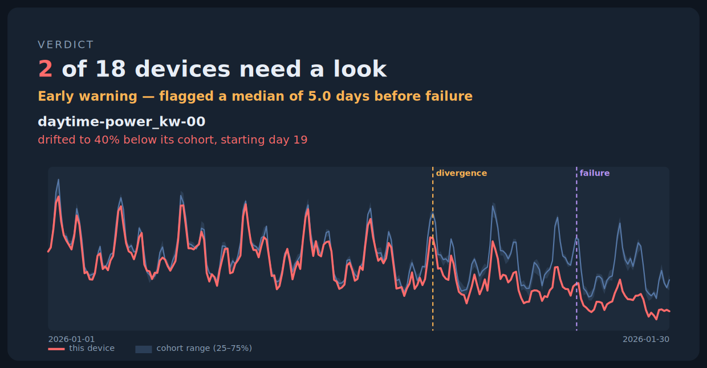

# BIoTan

[](https://pypi.org/project/biotan/)
[](https://pypi.org/project/biotan/)
[](LICENSE.md)

**무설정(zero-config), 또래-상대(peer-relative) 이상 탐지 — 동형(homogeneous) IoT 자산 fleet을 위한 도구.**

```bash
pip install biotan
```

[Demo](https://biotan.frontli.ne.kr)


BIoTan은 비슷한 기기들의 fleet — 태양광 인버터, 냉동 설비, 펌프, 드라이브, 센서 — 을 보고,
*임계값을 설정하거나 그룹을 수동으로 묶지 않아도* 어떤 기기가 또래에서 벗어나고 있는지 알려준다.

방법은 이렇다. 각 기기를 절대 한계값이 아니라, 같은 순간 또래들이 하고 있는 것과 비교한다.
날씨·부하·계절성 같은 공통 조건은 모든 또래에게 똑같이 작용해 상쇄되고, 진짜 의미 있는
편차만 남는다.

이 저장소는 **무료 오픈 코어**다 — 배치 백테스트 엔진. 과거 센서 데이터를 CSV로 주면,
코호트(cohort), 기기별 편차 타임라인, 그리고 플래그된 자산과 그 이유를 돌려준다.



## 설치

```bash
pip install biotan
```

또는 소스에서:

```bash
git clone https://github.com/Front-Line/bIoTan-core
cd bIoTan-core && pip install -r requirements.txt
```

## 60초 만에 시험하기 (데이터 불필요)

```bash
python scripts/make_synthetic.py --out demo.csv --faults 2 --validate
python -m biotan backtest --input demo.csv --labels demo.faults.csv --out report.html
```

두 개의 결함이 주입된 합성 fleet을 만든 뒤, 자기완결적 `report.html`을 생성한다.
보고서는 두 기기를 모두 플래그하고, 각 기기가 고장 며칠 전부터 또래에서 벗어나기
시작했는지 보여준다(이 데모에서는 중앙값 약 5일).

Python이 편하다면, 같은 파이프라인을 3줄로:

```python
import biotan
result = biotan.backtest("demo.csv", labels="demo.faults.csv")  # 라벨은 선택
print(result.summary)     # {'records': ..., 'devices': 18, 'flagged': 2, ...}
print(result.flagged)     # DataFrame: 플래그된 기기, 평이한 이유, 리드타임
result.to_html("report.html")
```

실제 데이터로 확인하고 싶다면? `python validation/run_cmapss.py` 가 NASA C-MAPSS
터보팬 fleet(엔진 100대, run-to-failure)을 내려받아 핵심 결과를 재현한다 —
또래-상대 편차가 100대 중 99대에서 고장 전 2σ를 넘는다.

## 왜 또래-상대인가?

대부분의 모니터링은 *"이 값이 임계값을 넘었나?"* 를 묻는다. 그러면 기기마다 임계값을
설정·조정·유지해야 하고, 공통 조건(흐린 날, 부하 급변)이 fleet 전체를 한꺼번에 움직일 때마다
오탐이 터진다.

BIoTan은 다른 질문을 한다. *"이 기기가 지금 또래와 다르게 행동하나?"* 이건 기기별 설정이
필요 없고, fleet 전체의 공통 변동(common-mode)을 자동으로 무시하며, 진짜 이상한 기기만
드러낸다 — 태양 각도 보정 후 이웃보다 12% 낮은 인버터, 코호트보다 빠르게 불량 섹터가
쌓이는 드라이브, 정상 기준선에서 벗어나며 고장에 가까워지는 엔진.

## 무엇을 하는가

- **자동 군집화(Auto-clustering)** — 데이터에서 행동 기반 코호트를 발견한다. 수동 태깅 불필요.
- **공통모드 제거(Common-mode removal)** — 각 기기를 매 시각 코호트 또래와 비교하되,
  강건한 통계(median / MAD)를 써서 일부 고장 난 또래가 기준선을 오염시키지 않게 한다.
- **다신호 탐지(Multi-signal detection)** — 고장은 종류마다 다르게 보이므로, 서로 독립적인
  여러 신호를 추적한다: 지속 편향(persistent offset), 점진적 변화/드리프트(drift),
  불안정성(instability), 그리고 경직성(rigidity — 또래보다 변동이 *훨씬 적은* 경우, 즉 고착).
- **effect-size 게이트** — 통계적 유의성과 *실무적* 유의성을 둘 다 만족해야 플래그한다.
  0에 가까운 노이즈로는 알림이 발생하지 않는다.
- **백테스트 타임라인** — 알고 있는 고장/교체 시점을 입력하면, 기기가 언제부터 벗어나기
  시작했는지 — 즉 *며칠 전에 알 수 있었는지* — 를 보여준다.

## 무엇을 하지 *않는가* (그리고 왜)

경계를 정직하게 밝히는 것이 핵심이다.

- **고장을 보장하는 예측기가 아니다.** 어떤 고장은 데이터에 사전 신호 없이 일어난다.
  어떤 또래-상대 방법도 그건 못 잡는다. BIoTan은 **위험을 우선순위화하고 열화를 추적하는
  도구**다 — 무엇을 먼저 봐야 할지 알려줄 뿐, 플래그되지 않은 것이 안전하다고 말하지 않는다.
- **문맥적 이상(contextual anomaly)은 잘 못 잡는다** — 값은 정상 범위 안이지만
  맥락/타이밍상 틀린 경우. 이런 건 더 정교한 시계열 모델이나 사용자 라벨이 필요하다.
- **백테스트 리드타임은 낙관적 상한이다.** 백테스트는 이미 일어난 데이터에 맞춰 조정되므로,
  실시간 결과는 다를 수 있다.
- **이 코어는 배치 전용이다.** 실시간 수집, MQTT/스트림/데이터베이스 커넥터, fleet 운영,
  알림 발송(Slack/PagerDuty/이메일), 다중 노드 관리는 **이 저장소에 포함되지 않는다.**

## 검증

코어 방법론은 서로 매우 다른 센서 물리를 가진 7개의 독립 데이터셋으로 검증했다 —
합성 fleet, 실제 대기질·기후 데이터, 실제 고장 라벨이 있는 하드디스크 SMART 텔레메트리,
NASA 터보팬 열화, 그리고 실제 위성 텔레메트리. 결론은 한결같았다. 위치/조건이 충분히 강한
흔적을 남기는 곳에서 또래-상대 편차는 실제 문제를 추적한다. 신호가 약하거나 이상이
문맥적일 때는 단순 방법이 한계에 부딪힌다.

실제 공개 데이터에 대한 재현 가능한 검증이 [`/validation`](./validation)에 포함돼 있다 —
`python validation/run_cmapss.py` 를 실행하면 **NASA C-MAPSS FD001** 터보팬 fleet
(엔진 100대, 실제 고장 시점까지 run-to-failure)을 내려받아 그 수치를 재현한다. 이 데이터에서
공통모드 제거는 100대 중 99대에서 고장 전 peer-z를 2σ 이상으로 끌어올렸고, 보수적인
무설정 게이트는 가장 빠르게 열화하는 엔진을 중앙값 약 11사이클의 리드타임으로 확인했다.
한계도 정직하게 드러난다. 행동 프로파일 군집화는 일(日) 주기 데이터를 가정하므로, 비주기적
run-to-failure fleet은 단일 코호트로 분석하는 것이 가장 낫다(스크립트가 두 경우를 모두 보여준다).

## 빠른 시작

```bash
pip install -r requirements.txt
python -m biotan backtest --input your_data.csv --out report.html
```

CSV에는 최소 세 개의 컬럼이 필요하다: `device_id`, `timestamp`, `value`.
선택: `metric`, `group`, `unit`. 모든 것이 로컬에서 실행된다 — **데이터는 절대
당신의 기기를 떠나지 않으며, 텔레메트리도 없다.**

알려진 코호트와 주입된 결함이 있는 합성 데이터로 시험해볼 수 있다:

```bash
python scripts/make_synthetic.py --out demo.csv --faults 2 --validate
python -m biotan backtest --input demo.csv --labels demo.faults.csv --out report.html
```

### 명령어

엔진은 하나의 배치 파이프라인으로 동작하지만, 각 단계를 따로 실행할 수도 있다
(모두 CSV를 읽으며, 수동 설정은 없다):

| 명령어 | 하는 일 |
|---------|--------------|
| `python -m biotan summarize --input data.csv` | 파싱 + 정규화. fleet 요약과 추론된 주기(cadence) 출력 |
| `python -m biotan cluster --input data.csv` | 행동 기반 코호트 발견 (자동, 무설정) |
| `python -m biotan peerz --input data.csv` | 또래-상대 편차(peer-z) 타임라인, 공통모드 제거됨 |
| `python -m biotan signals --input data.csv` | 기기별 4개 탐지 신호 |
| `python -m biotan flag --input data.csv` | effect-size 게이트 적용. 플래그된 기기 + 이유 나열 |
| `python -m biotan backtest --input data.csv --out report.html [--labels failures.csv]` | 전체 파이프라인 → 자기완결적 HTML 보고서 (라벨 주면 리드타임 포함) |

리드타임용 라벨 CSV에는 `device_id` 와 `fault_start` 가 필요하다(선택: `metric`).
HTML 보고서는 단일 자기완결 파일이다 — SVG 차트 인라인, 외부 자산 없음, 네트워크 호출 없음.

모든 파이프라인 명령은 `--single-cohort` 옵션도 받는다 — 자동 군집화를 건너뛰고 metric 안의
모든 기기를 하나의 코호트로 묶는다. zero-config(일 주기 가정) 군집화가 과분할하는 동형
(homogeneous)·**비주기** fleet(예: run-to-failure 데이터)에 사용하라.
`validation/run_cmapss.py` 가 설명하는 단일 코호트 모드와 동일하며, 자동 군집화 자체는
바뀌지 않는다.

## 코호트 이벤트 탐지

위의 모든 것은 전체 기간에 걸쳐 *"어느 기기가 이상한가?"* 를 묻는다. **코호트 이벤트 탐지**는
다른 질문을 한다. **고정된** 코호트(자동 군집화가 아니라, 당신이 지정한 컬럼)가 주어졌을 때,
구성원들이 **언제** 공통 기준선에서 벗어나기 시작했고 **누가** 벗어났는가? 문을 열면 문 근처
센서부터 데워지는 냉동고 구역을 떠올리면 된다.

```bash
python -m biotan events --input data.csv --cohort-col group --report events.html
```

**Mode A (기본) — 또래-상대.** 각 원칙은 의도된 것이다:

- **자기 과거가 아니라 합의(consensus).** 기준선은 매 시각 코호트의 강건한 합의(median / MAD)다.
  즉 한 구성원이 자기 과거와 달라진 게 아니라, 구성원들이 *서로 벌어지는* 것을 잡는다.
- **미분 공간.** 1차 차분으로 비교하므로 구성원 간 절대 레벨 차이는 무관하고, 오직 *어떻게
  움직이는가* 만 본다.
- **CUSUM 온셋.** 양측 CUSUM이 각 구성원의 부호 있는 편차를 누적한다. 지속되는 작은 드리프트는
  발화하고 일시적 노이즈는 무시되며, 누적 시작점이 이벤트 온셋을 추정한다.
- **부호 기반 부분집합.** 이벤트 안에서 영향받은 구성원은 *일관된 방향* 으로 벌어진 기기다 —
  크기가 아니라 부호 기반(크기 기반은 노이즈 많은 정상 기기를 끌어들이고, 부호 기반은 진짜
  부분집합을 깔끔히 분리한다).
- **주기 데이터는 먼저 주기 집계.** 일주기(예: 태양광) 데이터는 원시 차분 시 일출/일몰에서
  쓰레기 이벤트가 생기므로, 합의가 강한 일중(intra-day) 주기를 보이면 Mode A는 차분 전에
  일 단위로 집계한다. 정상상태 코호트는 원해상도를 유지해 일중 이벤트를 보존한다.

**무엇을** 그리고 **언제** 를 보고하며, **어떤 종류** 인지는 다루지 않는다(분류는 범위 밖).

**한계 (설계상, 정직하게):**

- **코호트의 50% 초과가 함께 벌어지면** 합의 자체가 오염된다 — 이는 전역 공통모드 이동이며
  BIoTan은 이를 이벤트가 아닌 기준선으로 보고 버린다.
- **락스텝(lockstep)** 으로 함께 열화하는 fleet에는 코호트 내 발산이 없으므로 Mode A는 침묵한다 —
  놓친 게 아니라 올바른 답이다.
- 온셋은 사후(hindsight) 추정으로 낙관적 상한이다(리드타임과 동일).

**검증 (정직한 수치).** 합성 30대 태양광 인버터 fleet에서 Mode A는 일 단위로 집계해 주입된
결함 인버터만 정확히 복원하고 노이즈 많은 정상 기기는 제외한다. 냉동고 구역에서는 문 열림
구간과 문 근처 부분집합을 정확히 복원한다. *완전한* 락스텝 fleet에서는 **0개** 이벤트를 낸다.
실제 **NASA C-MAPSS** 는 *준(near)* 락스텝이라(엔진마다 열화 속도가 조금씩 다름) 민감도 노브
`--min-effect` 가 중요하다. 기본값(4σ)에서는 더 빨리 열화하는 개별 엔진 ~16개를 드러내고,
조이면(≥8σ) 가장 극단적인 ~6개로 좁혀지며, 코호트 전역 이벤트를 결코 지어내지 않는다.
보수적인 "락스텝은 침묵" 관점을 원하면 `--min-effect` 를 높이고, 개별 빠른 기기를 보려면 낮춘다 —
둘 다 같은 데이터의 정직한 관점이다.

### Mode B (실험적, 옵트인) — 기준 궤적 편차

*모두가* 함께 열화하는 fleet(run-to-failure 터보팬)에서는 Mode A가 설계상 침묵한다. Mode B는
그 경우를 다르게 다룬다. 각 유닛을 **기준 데이터에서 학습한 정상 궤적**(다른 런, 다른 코호트,
또는 이 fleet 자신의 과거)과 수명 위치(life-position) 기준으로 비교해, 정상보다 더 일찍/빠르게
벗어나는 유닛을 표시한다.

```bash
python -m biotan events --input fleet.csv --export-reference profile.json          # 기준 생성
python -m biotan events --input new.csv --mode reference --reference profile.json  # 기준 대비 채점
```

**Mode B는 또래-상대가 *아니다*.** 학습된 정상 모델을 쓴다 — "정상 모델 없이 또래와 비교"라는
BIoTan 코어 철학과 다른 접근으로, 락스텝 열화 fleet을 커버하기 위한 절충이다. 옵트인이며 절대
기본값이 아니다.

- **센서를 결합하라 — 단일 센서는 무용지물.** NASA C-MAPSS로 검증: 단일 센서의 초기 편차는
  수명을 예측하지 못한다(Spearman ρ ≈ 0.06, 유의하지 않음). 다중 센서 결합 편차는 예측한다
  (우리 실행에서 ρ ≈ 0.37, p < 0.01; 프로토타입은 ≈ 0.46). 어느 쪽이든 이것은 **약하지만 실재하는
  초기 *위험 순위*이지 RUL 예측이 아니다** — 언제 고장 날지가 아니라 어떤 유닛을 먼저 볼지를
  알려준다.
- **이식 가능한 기준 프로파일.** 기준은 자기완결적·버전 관리되는 JSON이다(센서별, 수명 위치
  색인 median / MAD / scale, 그리고 메타데이터: 기기 종류, 환경, 단위, 출처, 메모). 이는 향후
  **공유 가능한 커뮤니티 프리셋**(다른 곳에서 만든 프로파일에 내 데이터를 돌리기)을 위한 의도된
  토대다 — 다만 **현재는 공유·레지스트리·업로드 기능이 없다**. 지금은 그저 깔끔하고 문서화된
  이식 가능한 파일일 뿐이다.

## 라이선스

BIoTan-core는 [PolyForm Noncommercial License 1.0.0](./LICENSE.md) 하에
source-available로 제공된다. 평가·연구·비상업적 사용은 무료다. 상업적/프로덕션 사용,
그리고 호스팅 서비스로 제공하는 것은 별도의 상업 라이선스가 필요하다 —
contact@frontli.ne.kr 로 문의.

Copyright (c) 2026 Victor Minbeom Joo d/b/a Front-Line.

---
*BIoTan은 오픈 코어다. 커넥터, 실시간 운영, fleet 관리는 별도로 제공된다.*
